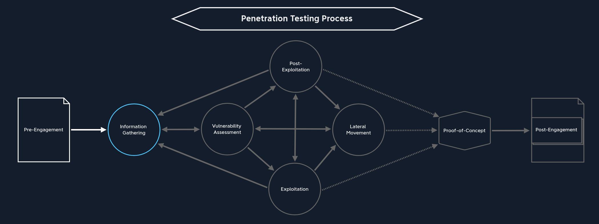
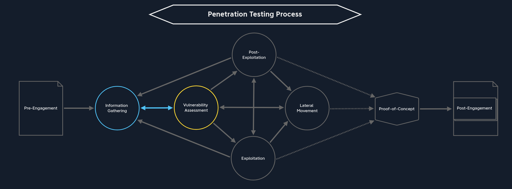
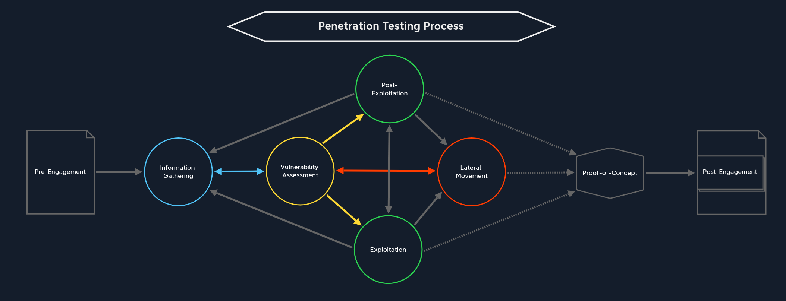
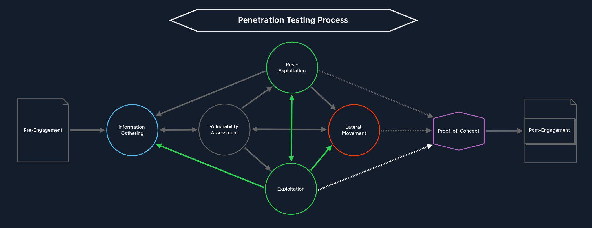
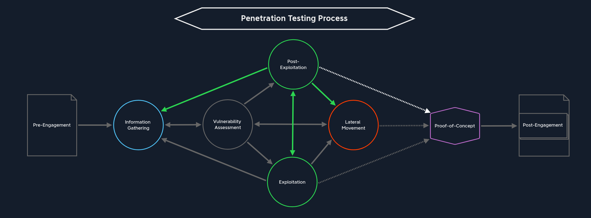
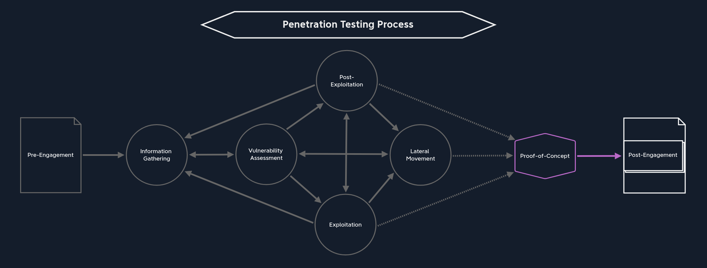
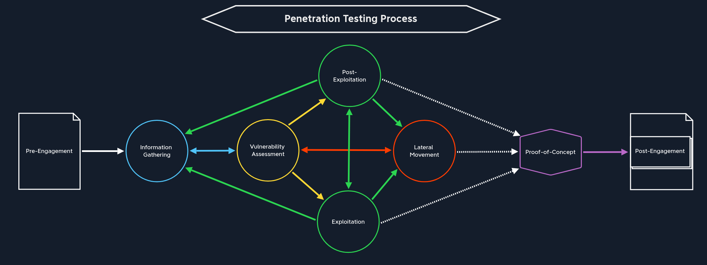

# Hacking Methodology

#### 1. [RECONNAISSANCE](/broken/pages/2IJ2HLGmvGYnlia0Yahv)

<figure><figcaption></figcaption></figure>

<figure><figcaption></figcaption></figure>

#### 2. [ENUM**ERATION**](/broken/pages/dLkJ30TymMi49ygn4L07)

<figure><figcaption></figcaption></figure>

#### **3.** [**EXPLOITATION**](/broken/pages/0x9lHfjB4EDHtSPrCaeX)

<figure><figcaption></figcaption></figure>

<figure><figcaption></figcaption></figure>

#### **4.** [**POST EXPLOITATION**](/broken/pages/uVp0t5e7aHueeHe3MPFA)

<figure><figcaption></figcaption></figure>

<figure><figcaption></figcaption></figure>

<figure><figcaption></figcaption></figure>
