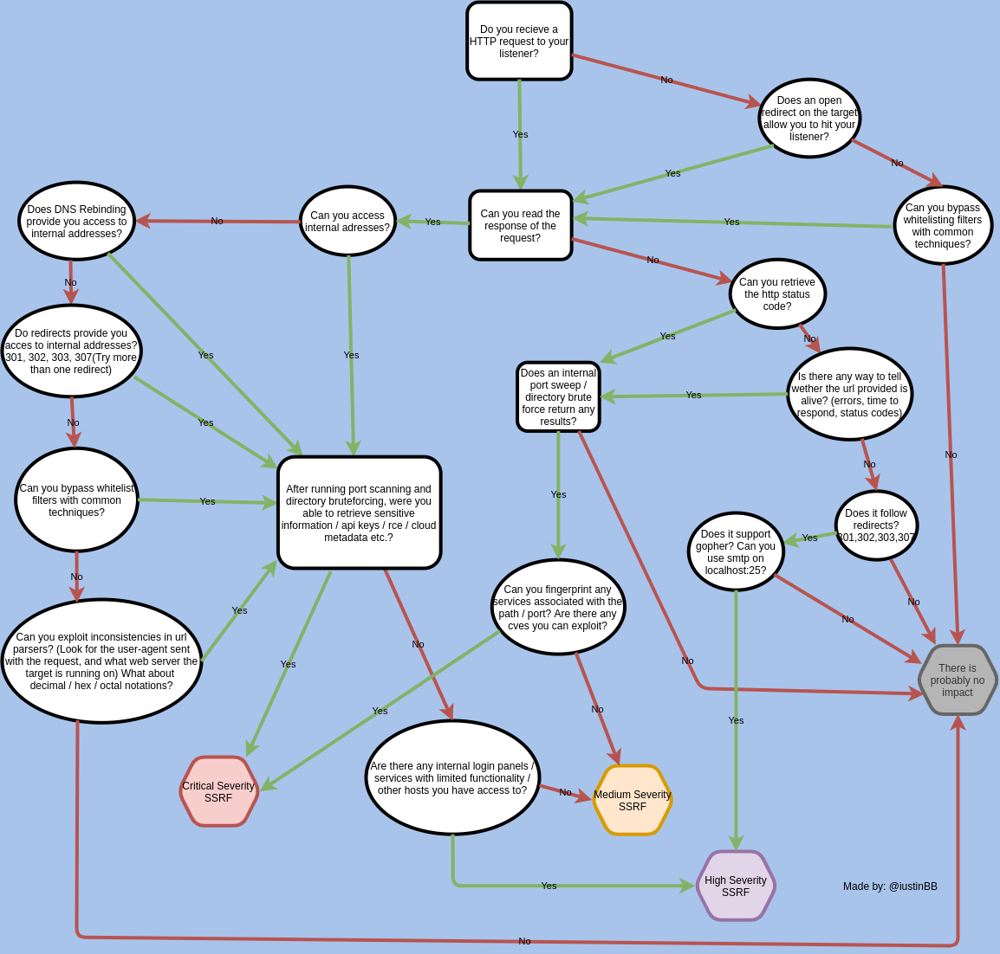

# Flipper Zero

In this section I will gather relevant information and techniques for Hardware Hacking with the Flipper Zero, one of the most popular hacking tools today.


[**Disclaimer:** The techniques described in this manual should be performed in a controlled environment and ethically. I am not responsible for the misuse of these techniques.](#user-content-fn-1)[^1]


<figure><figcaption></figcaption></figure>

## Introduction

In this section we will see an introduction to the Flipper Zero and how to configure it correctly.

### Official documentation 

Flipper Zero is constantly being updated, so it is recommended to check the official documentation:



### On 

Turn on the Flipper Zero by pressing and holding the **BACK** button for 3 seconds.

<figure><figcaption></figcaption></figure>

If your Flipper Zero won't turn on, its battery may be completely drained. To turn it on, simply connect the USB charging cable, and the device will power up automatically. If your Flipper Zero still won't turn on even after charging, try pressing and holding the LEFT and BACK buttons for 5 seconds. If your Flipper Zero still won't turn on, follow the steps outlined in Firmware Recovery .

### Restart 

If your Flipper Zero freezes while in use, press and hold the **LEFT** and **BACK** buttons for 5 seconds to reset the device.

<figure><figcaption></figcaption></figure>

If your Flipper Zero freezes, restart it. The Flipper Zero can be restarted in several modes, including recovery mode. For more information about the restart types, visit [Restart](https://docs.flipperzero.one/basics/reboot) .

### Insert a microSD card 


A microSD card is required to use the device. Flipper Zero does not come with a microSD card, so you will need to purchase one separately.


The microSD card stores various types of data, such as keys, cards, remote controls, databases, and more. The Flipper Zero supports microSD cards up to 256 GB, but a **4 GB microSD card is sufficient** for storing all your necessary data. Keep in mind that the Flipper Zero may take longer to recognize a microSD card with a larger storage capacity.

For more information, visit the [MicroSD card settings](https://docs.flipper.net/basics/sd-card) page .

Insert the microSD card with the pins facing upwards. Use a high-quality microSD card.

<figure><figcaption></figcaption></figure>

It is important to use high-quality, brand-name microSD cards, such as SanDisk, Kingston, or others, to ensure proper performance of your Flipper Zero. Using low-quality microSD cards can not only result in poor performance but may also brick or even damage your device.

If your Flipper Zero does not recognize the card, visit [the relevant section of the MicroSD card settings page](https://docs.flipper.net/basics/sd-card#rtpsy) .

### Update the firmware 

Insert a microSD card before updating your Flipper Zero. Make sure you have a microSD card in your Flipper Zero before updating the firmware: the device needs it to store its databases. For more information, see [MicroSD Card Setup.](https://docs.flipperzero.one/basics/sd-card)

The Flipper Zero firmware is under active development and changes frequently. We recommend updating your Flipper Zero firmware to the latest version immediately.

You can update your Flipper Zero via the Flipper or [qFlipper ](https://docs.flipperzero.one/qflipper)[mobile app](https://docs.flipperzero.one/mobile-app) :

With **the Flipper mobile app** , you can update your Flipper Zero directly from your phone via Bluetooth. The Flipper mobile app is available for iOS and Android.

### Connect the phone to Flipper Zero 

Once you have downloaded the Flipper mobile app, you can connect your phone to your Flipper Zero:

1. Turn on Bluetooth on your phone.
2. Activate Bluetooth on your Flipper Zero:

* Go to **Main Menu -> Settings -> Bluetooth**
* Set **Bluetooth** to **ON**

1. In the Flipper mobile app, tap **Connect** .
2. On the next screen, next to the name of the detected Flipper Zero, tap **Connect** .

<figure><figcaption></figcaption></figure>

In the Flipper mobile app, **enter the pairing code** shown on the Flipper Zero screen.

1. Tap **Pair** to complete the pairing.

### Update Flipper Zero through the Flipper app 

To update your Flipper Zero via the Flipper mobile app, do the following:

1. On the Main Menu tab, tap the **Update button.**
2. Tap the **Update** button to confirm the action.

The update via the Flipper mobile app may take **up to approximately 10 minutes** .

<figure><figcaption></figcaption></figure>

For additional information about the firmware update steps, visit [Firmware Update](https://docs.flipperzero.one/basics/firmware-update) .

### Customize system preferences 

Once you have updated your Flipper Zero, you can modify the system settings, such as switching to left-handed mode, configuring your preferred units of measurement, and selecting the date and time format. To access the system settings, go to **Main Menu -> Settings -> System** .

<figure><figcaption></figcaption></figure>

For more information, visit the [Settings](https://docs.flipper.net/basics/settings) page .

### Battery charging 

To charge the Flipper Zero, connect the included USB Type-C cable to the charging port and a power source. A full charge of the device takes approximately two hours.

<figure><figcaption></figcaption></figure>

To view battery information, go to **Main Menu -> Settings -> Power -> Battery Info**

<figure><figcaption></figcaption></figure>

### Turn off the Flipper 

To turn off your Flipper Zero, go to **Main Menu -> Settings -> Power -> Power off** and confirm the action by pressing the **RIGHT** button .

<figure><figcaption></figcaption></figure>

Do not leave the device discharged for long periods. Avoid leaving your Flipper Zero discharged for extended periods. If you plan to leave the Flipper Zero off for an extended period, we recommend charging the device to approximately 50% before turning it off.

Leaving the device discharged for an extended period can degrade battery health.

### Power modes 

Flipper Zero has two operating modes: **Active** and **Suspended** . Each mode consumes energy differently.

#### Active mode 

When Flipper Zero runs an application or establishes a connection, the device enters Active mode, which consumes up to 30 mA with the backlight on. With an active transceiver, power consumption can reach 400 mA, and even 2 A with an active transceiver and an external module connected.

<figure><figcaption></figcaption></figure>

View real-time power consumption. Use a high-quality microSD card for longer battery life. When the screen backlight is on, the Flipper Zero's current consumption with a genuine brand microSD card is up to 30 mA. With a non-genuine microSD card, the total current consumption can reach up to 50 mA, reducing your device's battery life. If your Flipper Zero's battery is draining quickly, check the current consumption: Main Menu -> Settings -> Power -> Battery Information.

#### Sleep mode 

When there are no running applications or established connections on your Flipper Zero, the device enters sleep mode, which has a power consumption of around 1.5 mA.

<figure><figcaption></figcaption></figure>

In sleep mode, the device consumes approximately 1.5 mA. For sleep mode to function correctly, debugging mode must be disabled. You can disable debugging mode by going to Main Menu -> Settings -> System, selecting Debugging, and setting it to OFF.

There are two sleep modes available for the Flipper Zero: **default** and **legacy** . The default sleep mode consumes approximately 1.5 mA of power, resulting in longer battery life. However, you may experience device malfunctions while using this mode. The legacy sleep mode consumes 9 mA of power, resulting in shorter battery life but providing greater stability to your device.

You can switch to legacy sleep mode in **Main Menu -> Settings -> System** and by setting **Sleep Method** to **Legacy** .

### Tips for maximizing battery performance 

**Battery life** is the amount of time the Flipper Zero operates before needing to be recharged. **Battery life** is the time the battery lasts until it needs to be replaced.

#### Long-lasting battery 

* Update to the latest firmware version. -> [Update your Flipper Zero](https://docs.flipperzero.one/basics/firmware-update) regularly as we are constantly optimizing the firmware and adding new power-saving features.
* Optimize your settings. -> You can adjust parameters in the [Settings](https://docs.flipperzero.one/basics/settings) app , such as Bluetooth, display, and system settings.

#### Long battery life 

* Avoid extreme ambient temperatures. -> Flipper Zero is designed to operate within a temperature range of 0° to 40° C (32° to 104° F). Avoid exposing your device to ambient temperatures outside this specified range.
* Store the device half-charged when it will be turned off for extended periods. -> Charge your Flipper Zero to approximately 50% before turning it off for an extended period.



### &#x20;



[^1]: 
